# 完美的 bilibili 录制方案

## why

一条龙服务，还可以多机操作，爽爆！

## what

依赖如下组件
- redis
- ffmpeg
- obs
- smb

### 图解

## how

1. 拖拽视频到 `append_render_redis.bat`。
2. 打开 `render_video.ps1` 执行渲染视频命令。
3. 打开 `upload_video.ps1` 等待视频上传。
4. 打开 `bilibili`，欣赏你上传的影片。